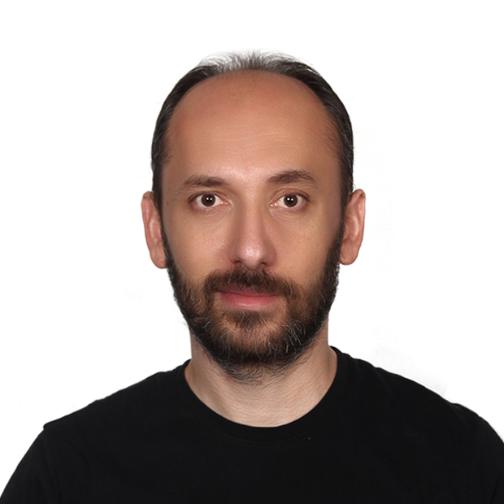

:::: {.about-intro}
::: {.about-intro-copy}
Physicist working across particle physics, high-performance computing, and scientific software. Affiliated with Middle East Technical University and TÜBİTAK ULAKBİM.

This site is where I keep reusable notes on physics, computing, and research workflows. It is a notebook, not a complete account of my work.
:::

::: {.about-photo}
{fig-alt="Portrait of Selçuk Bilmiş"}
:::
::::

## Links

- [INSPIRE-HEP — papers with fewer than 45 authors](https://inspirehep.net/literature?sort=mostrecent&size=50&page=1&q=f%20a%20s%20bilmis%20and%20authorcount%20%3C%2045)
- [ORCID](https://orcid.org/0000-0002-0830-8873)
- [Google Scholar](https://scholar.google.com/citations?user=QWQsoeIAAAAJ)
- [GitHub](https://github.com/sbilmis)
- [LinkedIn](https://www.linkedin.com/in/selcuk-bilmis-06781288/)

## Why keep notes in public?

Most notes begin for a simple reason: I do not want to solve the same small problem twice.

A private notebook is useful, but a public one adds a little helpful pressure. Explanations need enough context to survive beyond the moment in which they were written. Commands should include their assumptions. Links should not be the entire argument.

This is not intended to be a regular publication schedule. A page is added when something seems worth keeping.

## Contact

[sbilmis@metu.edu.tr](mailto:sbilmis@metu.edu.tr)  
Ankara, Türkiye
